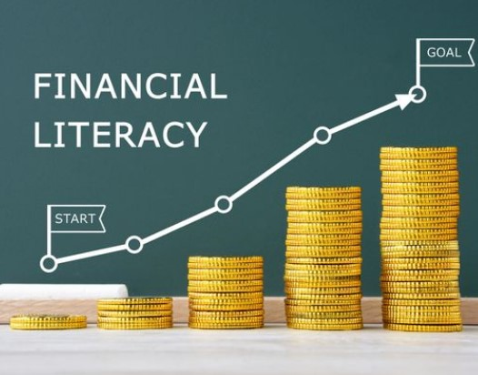

import imageDeanRobert from '@/images/team/dean-robert.jpg'

export const article = {
  date: '2022-12-01',
  title: 'Financial Literacy 1: Your Gateway to Smart Money Management',
  description:
    'This 10-week introductory reviews a wide variety of reference stories of inspiration, relevant current economic variables and lifelong financial skills to attendees.',
  author: {
    name: 'Dean Robert',
    role: 'Founder / CEO',
    image: { src: imageDeanRobert },
  },
}

export const metadata = {
  title: article.title,
  description: article.description,
}

## 1. Building Financial Foundations

The mission of **Financial Literacy 1** is to
expose our community to practical
economic principles governed by **financial
best practices** and to grasp new concepts
**easy to integrate** moving forward. 

<TopTip>
  "A budget is telling your money where to go instead of wondering where it went." 
  – John C. Maxwell
</TopTip>

## 2. Simple Steps to Mastering Financial Literacy

This 10-week introductory reviews a wide variety of
reference stories of inspiration, relevant current
economic variables and lifelong skills to
attendees towards financial freedom. 

Selective subject matter is podcast
driven utilizing the Securus Tablet and
Podcasts application issued to each
community offender.
This program hosts the select podcast immediately
followed by a group discussion on said topic.

From time to time, basic workbook
sessions will follow (i.e., how to balance a
checkbook), where practical
application of content can be explored.

## 3. Concept to Conquest

Teaching basic concepts of financial responsibility and building upon them incrementally is a proven strategy for fostering financial independence 
and long-term responsibility. Studies show that individuals who start with foundational skills, such as budgeting, understanding credit, and managing 
expenses, are more likely to develop positive financial habits over time. For instance, research from the Consumer Financial Protection Bureau indicates 
that hands-on learning, such as creating a personal spending plan or simulating real-world financial decisions, increases financial literacy retention 
rates by up to 40%. By layering advanced concepts—like investing, retirement planning, and risk management—on top of these basics, 
learners can build a comprehensive understanding of financial systems. This step-by-step approach empowers individuals to make informed decisions, 
avoid common financial pitfalls, and achieve sustained economic stability.

**JOIN US!** We are proudly delivering a responsive
cultural change in our communities through **life skills**
preparation and **simulative business environments**.
